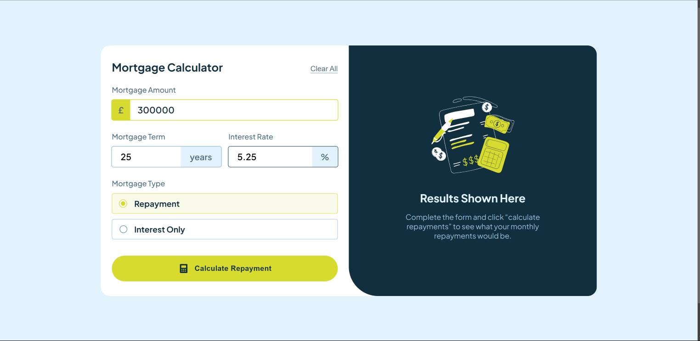

# Frontend Mentor - Mortgage repayment calculator solution

This is a solution to the [Mortgage repayment calculator challenge on Frontend Mentor](https://www.frontendmentor.io/challenges/mortgage-repayment-calculator-Galx1LXK73). Frontend Mentor challenges help you improve your coding skills by building realistic projects.

## Table of contents

- [Overview](#overview)
  - [The challenge](#the-challenge)
  - [Screenshot](#screenshot)
  - [Links](#links)
- [My process](#my-process)
  - [Built with](#built-with)
  - [What I learned](#what-i-learned)
  - [Useful resources](#useful-resources)
- [Author](#author)

## Overview

### The challenge

Users should be able to:

- Input mortgage information and see monthly repayment and total repayment amounts after submitting the form
- See form validation messages if any field is incomplete
- Complete the form only using their keyboard
- View the optimal layout for the interface depending on their device's screen size
- See hover and focus states for all interactive elements on the page

### Screenshot

### Links

- Solution URL: (https://www.frontendmentor.io/solutions/mortgage-repayment-calculator---html-css-and-js-6eK1vTwSbZ)
- Live Site URL: (https://mike-kay.github.io/02-mortgage-repayment-calculator-main/)

## My process

### Built with

- Semantic HTML5 markup
- CSS custom properties
- Flexbox
- CSS Grid
- Mobile-first workflow
- Pure Javascript

### What I learned

Due to the limitation of styles that can be applied to default radio input, I learned how to create keyboard accessible custom radio buttons.

### Useful resources

- [Custom radio button](https://www.a11ywithlindsey.com/blog/create-custom-keyboard-accessible-radio-buttons) - This is an amazing article on how to create keyboard accessible radio buttons. I'd recommend it to anyone still learning this concept.
- [JS Mortgage Calculator formula](https://codepen.io/andarch/pen/qBxpeY) - This helped me implement the formula required for mortgage calculation.

## Author

- Frontend Mentor - [@Mike-Kay](https://www.frontendmentor.io/profile/Mike-Kay)
- Twitter - [@Mike_Kay1](https://www.twitter.com/@Mike_Kay1)
